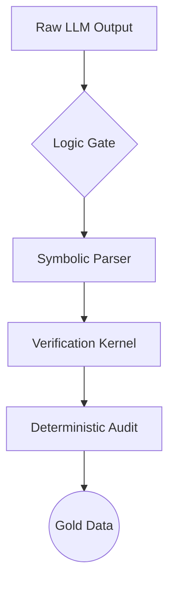

# Logic-Gate-v1: Deterministic Validation Framework

**Logic-Gate-v1** is a specialized auditing layer for LLM reasoning.

## 📊 System Architecture

🚀 The Solution: Deterministic Auditing
Logic-Gate-v1 acts as a Hard-Constraint Layer that identifies logical fallacies and ensures mathematical rigor in AI training pipelines.

🛠️ Quick Preview: Symbolic Check
See preview.py for the full functional code.

from preview import LogicGateValidator
validator = LogicGateValidator()
result = validator.verify_symbolic_step("x**2 + 1", "(x + 1)**2")
print(f"Audit Result: {result['status']}")

📈 Benchmarking

ScenarioInputLLM OutputStatusAlgebra(a+b)^2a^2 + b^2❌ REJECTEDLogicA implies BContradiction❌ REJECTED

🛠️ Getting Started
Currently in Private Beta. Connect via LinkedIn for strategic inquiries.

“In logic, there are no accidents.”
